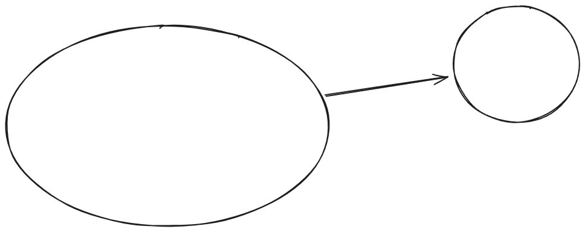
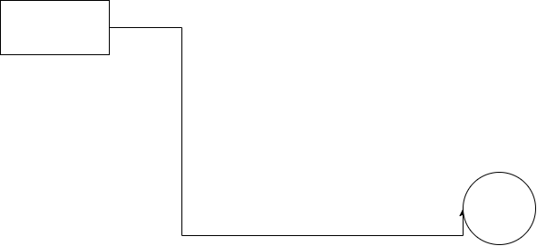

Tags: czxc, xc, xcc, sad, df, dff
Name: bikash

# RawNotes
# Diagrams in Notely

Notely has built-in support for live rendered diagrams.

- [x] Weh ave a .ot of text snakjaf fj dfhdsfkljlkdsf
### Mermaid Support
- Hello worls
- apple
- Create flowchart diagrams using standard Mermaid code blocks:

[ ] hghg 

gcgh
asdkl
sdf

------------------------------

**kk**


| Column 1 | Column 2 | Column 3 |
| --- | --- | --- |
| Value 1.1 | Value 1.2 | Value 1.3v |
| Value 2.1 | Value 2.2 | Value 2.3 |
| Value 3.1 | Value 3.2 | Value 3.3 |

jkl


```mermaid
graph TD
    A[Start Onboarding] --> B[Choose Folder]
    B --> C[Personalize Theme]
    C --> D[Begin Writing Notes!]
```.


```mermaid
flowchart TD
    %% Subgraph: Authentication & Security
    subgraph Auth["🔐 Security & Authentication"]
        A["Client App"] -->|1. Request Token| B["API Gateway"]
        B --> C{"Valid Credentials?"}
        C -->|No| D[["Return 401 Unauthorized"]]
        C -->|Yes| E(["Generate JWT Token"])
    end

    %% Subgraph: Core Processing System
    subgraph Engine["⚡ Core Processing Engine"]
        E -->|2. Authorize Payload| F["Job Queue Listener"]
        F --> G{"Queue Priority"}
        G -->|High Priority| H["Priority Worker Pool"]
        G -->|Standard| I["Standard Worker Pool"]
        H ==> J(("Process Task"))
        I --> J
    end

    %% Subgraph: Storage & Notifications
    subgraph Storage["💾 Persistence & Dispatch"]
        J --> K{"Validation Check"}
        K -.->|Failed| L["Dead Letter Queue"]
        K -->|Passed| M["Postgres Main Database"]
        M --> N["Redis Cache Invalidate"]
        N --> O["Notification Dispatcher"]
        O --> P(["Finish Pipeline"])
    end

    %% Node Styling Directives
    style A fill:#1e3a8a,stroke:#3b82f6,color:#ffffff
    style E fill:#064e3b,stroke:#10b981,color:#ffffff
    style D fill:#881337,stroke:#f43f5e,color:#ffffff
    style J fill:#78350f,stroke:#f59e0b,color:#ffffff
    style P fill:#064e3b,stroke:#10b981,color:#ffffff

```


Teh 
### Excalidraw Support
You can insert sketch blocks to draw diagrams by clicking the Excalidraw button in the toolbar.

```js
const a = "apple";
var a = [];
for (let i = 0; i < 10; i++)
  a.map((x) => {
    a = x;
  });
```
Hello

{data-diagram-id="7a5505f6" data-diagram-type="excalidraw"}


{data-diagram-id="774530a7"}{data-diagram-id="88e26613" data-diagram-type="excalidraw" data-origin-asset="/media/images/screenshot-20260716-211419.png" data-origin-alt="Screenshot"}

[asd](adsd)

```javascript
const x = "sdf";
console.log(x);
```

d


# Cleansed
Diagrams in Notely. Create flowchart diagrams using standard Mermaid.
